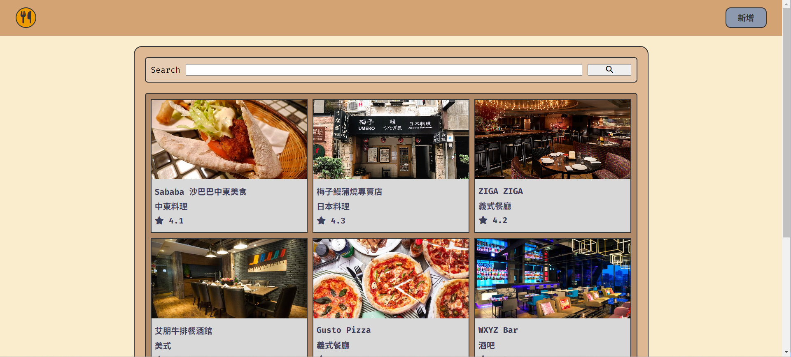

# 我的餐廳清單



## 介紹

紀錄屬於自己的餐廳清單，可以瀏覽餐廳、查看詳細資訊、甚至連結到地圖。

### 功能

- 查看所有餐廳
- 瀏覽餐廳的詳細資訊
- 連結餐廳的地址到 Google 地圖
- 搜尋特定餐廳
- 新增餐廳資訊
- 編輯餐廳資訊
- 刪除餐廳資訊
- 文章排序功能 (new)
- 文章分類schema (new)
- 成功與失敗訊息 (new)
- 分頁功能 (new)

欲更改顯示頁數請修改./routes/restaurants.js的第20行:

const limit = 3

## 開始使用

1. 請先確認有安裝 node.js, npm, mysql
2. 將專案 clone 到本地
3. 在本地開啟之後，透過終端機進入資料夾，輸入：

   ```bash
   npm install
   ```

4. 在root資料夾創立包含以下資訊的.env檔：

   ```bash
   SESSION_SECRET=XXXXXXXXXXXX
   ```

5. 安裝完畢即完成環境參數設置後後，請依序輸入：

   (包含db建立/migrations/seeders)

   如Mysql已存在名為rest的db,請在./config/config.json更改

   ```bash
   npm run db:init
   npm run start
   ```

6. 若看見此行訊息則代表順利運行，打開瀏覽器進入到以下網址

   ```bash
   http://localhost:3000/restaurants
   ```

7. 如不成功,可以擇一以下方式確認環境變數NODE_ENV=development：

   Power Shell

   ```bash
   $env:NODE_ENV = "development"
   echo $env:NODE_ENV
   ```

   CMD

   ```bash
   set NODE_ENV=development
   echo %NODE_ENV%
   ```

   Git Bash

   ```bash
   export NODE_ENV=development
   echo $NODE_ENV
   ```

   Manual Settings:

   Win + R > sysdm.cpl > Advanced > Environment Variable > 
   
   User variables for user > New

8. 若欲暫停使用

   ```bash
   ctrl + c
   ```

## 開發工具

- Node.js 20.11.0
- Express 4.18.3
- Express-Handlebars 7.1.2
- Method-Override: 3.0.0
- Mysql2: 3.9.2
- Sequelize: 6.37.1
- Sequelize-Cli: 6.6.2
- Font-Awesome 6.5.1
- Connect-Flash 0.1.1
- Express-Session 1.18.0
- Dotenv 16.4.5